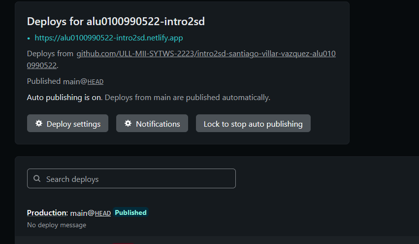
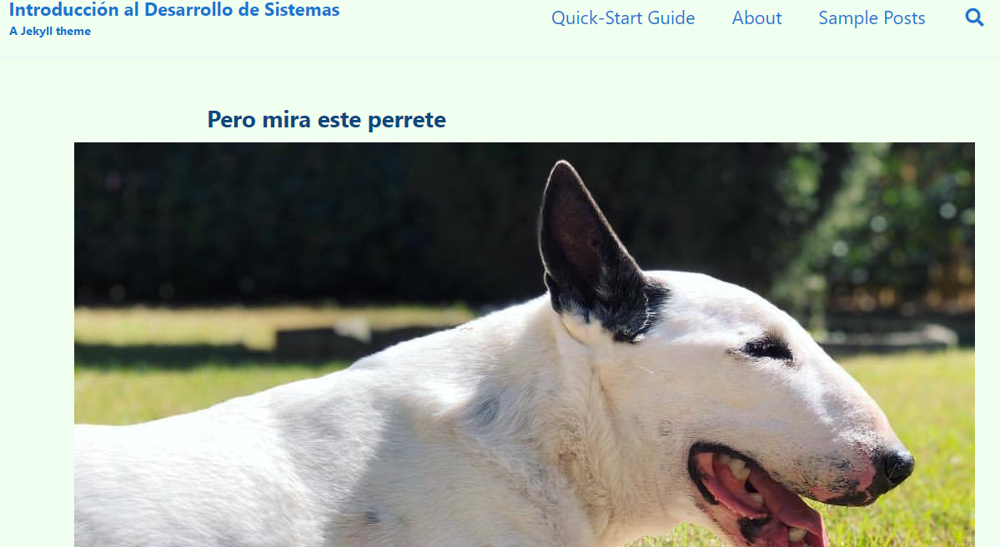

## Ejecutar el código
```bash
bundle install
rake serve
```

## Github pages
Despliegue del sitio web en  : https://ull-mii-sytws-2223.github.io/intro2sd-santiago-villar-vazquez-alu0100990522/

## Añadir post

Para añadir un post al documento deberemos añadir un nuevo archivo .md en la carperta _post con el formato AÑO/MES/DIA-NOMBRE.md

## Modificación de la configuración inicial
Tambien se modifico el archivo _config.yml, donde cambiaremos el tema de la página modificando (minimal_mistakes_skin) y luego en (baseurl) modificaremos la ruta de nuestra web, asi como un poco el perfil del usuario que muestra. 

## Netlify
Para la instalación del netlify seguiremos los pasos propuestos por esta web: 

https://www.netlify.com/blog/2020/04/02/a-step-by-step-guide-jekyll-4.0-on-netlify/

Tendremos que hacer publico este repositorio github para poder conectarlocon netlify, configurar como se despliega y lanzarlo



## Creación Collection

Para la creacion de una nueva collection deberemos de crear una nueva carpeta , en nuestro caso sera _books y en el archivo _config.yml añadiremos lo siguiente

```bash
collections:
  books:
    output: true
    permalink: /:collection/:path/
    
    
  defaults:  
    # _books
  - scope:
      path: ""
      type: books
    values:
      layout: single
      author_profile: false
      share: true
      comments: true

```

tambien deberemos de crear una nueva pagina en _pages para books.

## Liquid

Se añadio el siguiente código al archivo pets en la carpeta _page

```bash

    <h2>{{ pet.title }} </h2>   

```

## 404

Se debe añadir un archivo 404.md a la carpeta principal del proyecto con el siguiente codigo inicial
```bash
---
layout: default
permalink: /404.html
---
```

y luego todo el codigo html o md que quieras mostrar



